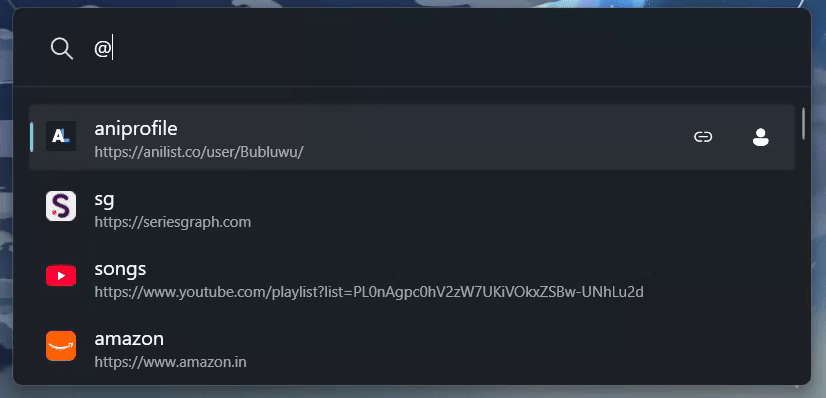
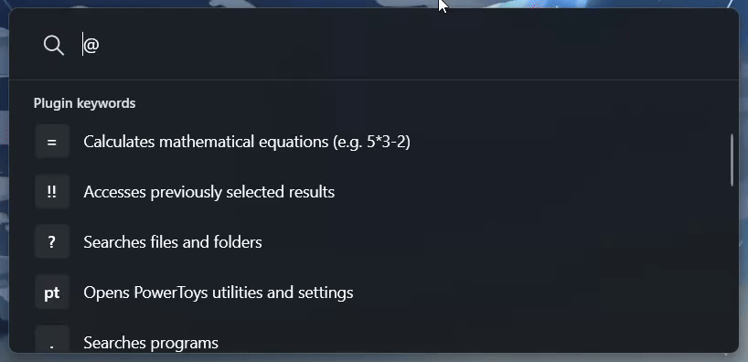

# 🚀 BrowserConnect for PowerToys Run


**BrowserConnect** is a PowerToys Run plugin for searching custom engines, opening URLs, browsing in incognito mode, and searching local history with fuzzy matching.

Start BrowserConnect in PowerToys Run with the action keyword `@`, then enter a search, URL, or command.

## 📚 Table of Contents

- [Key Features](#-key-features)
- [Feature Demos](#-feature-demos)
- [Command Guide](#-command-guide)
- [Context Menu Actions](#-context-menu-actions)
- [Supported Browsers](#-supported-browsers)
- [Local Files](#-local-files)
- [Prerequisites](#-prerequisites)
- [Installation](#-installation)
- [Uninstall](#-uninstall)
- [Development](#-development)
- [Project Structure](#-project-structure)
- [FAQ](#-faq)
- [Troubleshooting](#-troubleshooting)

## ✨ Key Features

- 🎯 **Custom Search Engines**:
  - **Define Aliases**: Create shortcuts such as `yt` for YouTube or `github` for GitHub.
  - **Search Templates**: Use `%s` to mark where the search query should be inserted into the URL.
- 🕘 **Fuzzy History Search**:
  - **Quick Access**: Use `!` to view recent search history.
  - **Recent First**: Shows your newest unique entries first, then scans older history when you search.
  - **Fuzzy Matching**: Type after `!`, such as `!code`, to search saved URLs, provider results, and normalized search queries.
  - **Normalized Entries**: Search history stores the cleaned query BrowserConnect actually ran, so flags like `-i` and engine aliases are not mixed into normal query text.
  - **Persistent**: History is stored locally in `history.txt`.
  - **Delete Entries**: Delete a history entry from the result context menu.
- 🕵️ **Incognito Search**:
  - **On-the-Fly**: Add `-i` to a search or URL to open it privately.
  - **URL Parsing**: URL inputs support `-i` at the start or end.
  - **Global Setting**: Enable "Incognito by default" in PowerToys settings.
- ⚙️ **Integrated Settings**:
  - **Record History**: Enable or disable history tracking.
  - **Record Incognito History**: Choose whether incognito searches are saved.
  - **Incognito by Default**: Automatically open searches privately.
  - **History Results Count**: Choose how many history results to show.
  - **Max History Entries**: Choose the history file limit.
  - **Automatically Truncate History**: Trim `history.txt` when the file limit is reached.
- 🔎 **Smart Filtering**:
  - **Instant Suggestions**: Type `@` followed by letters to filter matching search engines.
- 🚀 **Multi-Engine Queries**:
  - **Simultaneous Search**: Run the same query across multiple engines.
  - **Format**: List engines, with or without `@`, then `:` and the query.
  - _Example_: `yt brave : how to bake a cake`
- 📡 **Live Provider Results**:
  - **Direct Results**: Add `;` to supported engine searches to fetch live results in PowerToys Run.
  - **Supported Providers**: YouTube, AniList, and SeriesGraph.
  - **Automatic Provider Detection**: Supported providers are detected from your configured engine URLs.
  - **History Support**: Opening a live result stores its title, target URL, and thumbnail reference so it can be reopened from history.
  - **Thumbnail Cache**: Provider thumbnails are cached under `Thumbnails/`.
  - **YouTube API Keys**: YouTube live results use `google_api.txt`; AniList and SeriesGraph do not require local API keys.
- 🎨 **Icons and Context Menus**:
  - **Automatic Favicon Fetching**: Fetches favicons for new engines.
  - **Remembered Failures**: Failed icon downloads are remembered to avoid repeated retries.
  - **Adaptive Icons**: Uses dark/light icons based on the Windows app theme.
  - **Context Actions**: Copy URLs/titles/file paths, toggle incognito browsing, and delete history entries where supported.

## 📸 Feature Demos

### Search With Custom Engines



### Search and Manage History



### Live Provider Results


## ⌨️ Command Guide

These examples show the query after the `@` action keyword. For example, type `@ yt cake recipe` in PowerToys Run.

| Command | Action | Example |
| :------ | :----- | :------ |
| **`<alias> <query>`** | Search using a custom engine | `yt cake recipe` |
| **`@<alias> <query>`** | Search or filter by alias | `@yt ado songs` |
| **`<e1> <e2> : <query>`** | Multi-engine search | `ani yt : Summer Time Rendering` |
| **`<URL>`** | Open a URL directly | `google.com -i` |
| **`<cmd> -i`** | Force incognito mode | `yt -i secret` |
| **`<alias> <query> ;`** | Fetch live provider results | `yt vivarium ;` |
| **`!`** | View recent history | `!` |
| **`!<query>`** | Fuzzy search history | `!cake` |

### 🛠️ Utility Commands

- `-h` : Show the help menu.
- `-a @alias URL` : Add or update an engine.
- `-d @alias` : Delete an engine and its icons.
- `-r` : Reload engines and history, clear icon failure cache, and clear the YouTube cache.
- `-l` : Open `searchEngines.txt`.
- `-his` : Open `history.txt`.
- `-log` : Open `logs.txt`.

## 🖱️ Context Menu Actions

BrowserConnect adds context actions based on the selected result type:

| Result Type | Shortcut | Action |
| :---------- | :------- | :----- |
| URL-backed results | `Ctrl+C` | Copy URL |
| File-opening results | `Ctrl+C` | Copy file path |
| Results with a title | `Ctrl+Shift+C` | Copy result title |
| URL-backed results | `Ctrl+Shift+N` | Open in the opposite incognito state |
| History results | `Ctrl+Del` | Delete the history entry |

## 🌐 Supported Browsers

Normal browsing uses your Windows default browser. Incognito mode is supported when BrowserConnect can detect one of these browser executables:

| Browser | Incognito Mode |
| :------ | :------------- |
| Google Chrome | `--incognito` |
| Brave | `--incognito` |
| Microsoft Edge | `--inprivate` |
| Firefox | `-private-window` |
| Opera | `--private` |
| Vivaldi | `--incognito` |
| Arc | `--incognito` |

If the default browser cannot be detected, BrowserConnect falls back to the Windows URL handler. That fallback can still open URLs normally, but it cannot force incognito mode.

## 📂 Local Files

The plugin stores its data locally in the plugin folder:

- **`searchEngines.txt`**: Search engine aliases, one per line: `alias URL`.
- **`history.txt`**: Search history for normalized engine queries, multi-engine searches, direct URLs, and opened live-provider results.
- **`logs.txt`**: Internal logs for troubleshooting.
- **`google_api.txt`**: Optional YouTube Data API keys, one per line.
- **`Images/`**: Bundled icons and cached engine favicons.
- **`Thumbnails/`**: Cached live-provider thumbnails.

History records the action that was opened. Normal engine searches save the cleaned query text after parsing the alias and `-i` flag. Multi-engine searches save one replayable multi-engine entry plus entries for each selected engine. Direct URLs save the normalized URL. Live provider results save the opened result title, URL, and thumbnail reference. When viewing history, BrowserConnect shows the newest unique engine/payload pairs first.

Example `searchEngines.txt` entries:

```text
google https://www.google.com/search?q=%s
yt https://www.youtube.com/results?search_query=%s
github https://github.com/search?q=%s&type=repositories
```

Use `%s` where the search query should be inserted. If `%s` is not present, the engine behaves like a direct browse shortcut.

Live provider results are currently matched by these URL patterns:

```text
youtube.com/results?search_query=%s
anilist.co/search/anime?search=%s
seriesgraph.com/show/search/%s
```

## ✅ Prerequisites

- Windows with PowerToys installed.
- PowerToys Run enabled.
- .NET 9 SDK or later.

## 🚀 Installation

1. **Clone the repo**:
   ```powershell
   git clone https://github.com/bharath6115/BrowserConnect_PowerToysRun.git
   cd BrowserConnect_PowerToysRun
   ```
2. **Build**: Run `build-plugin.bat`.
   - This performs a clean Release build.
3. **Install**: Run `install-plugin.bat`.
   - The script preserves existing `history.txt`, `searchEngines.txt`, and `google_api.txt`.
   - It closes and restarts PowerToys automatically when possible.
4. **Setup YouTube Live Results (Optional)**:
   - Visit https://console.cloud.google.com and create a project.
   - Enable "YouTube Data API v3".
   - Create an API key for public data.
   - Add one or more API keys, one per line, to `google_api.txt` in the plugin folder:
     `%LOCALAPPDATA%\Microsoft\PowerToys\PowerToys Run\Plugins\BrowserConnect`
   - This enables YouTube results for searches such as `yt lofi ;`.

## 🧹 Uninstall

Close PowerToys, then delete the BrowserConnect plugin folder:

```text
%LOCALAPPDATA%\Microsoft\PowerToys\PowerToys Run\Plugins\BrowserConnect
```

Restart PowerToys after removing the folder.

## 🧪 Development

Build the plugin:

```powershell
dotnet build BrowserConnect.csproj
```

Run the test suite:

```powershell
dotnet test BrowserConnect.Tests\BrowserConnect.Tests.csproj
```

## 🧱 Project Structure

```text
BrowserConnect/
|-- Main.cs                    # Plugin entry point
|-- Handlers/                  # Flag and history command handlers
|-- Services/                  # Browser, engine, history, icon, context menu, and query services
|-- Providers/                 # Live result providers
|-- Models/                    # Provider and context models
|-- Settings/                  # PowerToys settings
|-- Utils/                     # Parsing, URL, result, and file helpers
|-- BrowserConnect.Tests/      # Unit tests
|-- libs/                      # PowerToys/Wox dependencies
|-- Images/                    # Static icons
|-- plugin.json                # Plugin metadata
|-- BrowserConnect.csproj      # Project file
|-- browserConnect.sln         # Solution file
|-- build-plugin.bat           # Build script
`-- install-plugin.bat         # Installation script
```

## ❓ FAQ

**Why aren't YouTube live results showing?**

Make sure `google_api.txt` exists in the plugin folder and contains at least one valid YouTube Data API key. Live YouTube results also require an engine URL that matches `youtube.com/results?search_query=%s`.

**Why isn't incognito mode working?**

BrowserConnect can only force incognito mode when it detects a supported default browser. If detection fails, Windows opens the URL normally through the default URL handler.

**Where are my search engines stored?**

Search engines are stored in `searchEngines.txt` in the plugin folder. You can open it from BrowserConnect with `-l`.

## ⚠️ Troubleshooting

**Plugin doesn't appear in PowerToys Run**

- Check that the plugin is installed in:
  `%LOCALAPPDATA%\Microsoft\PowerToys\PowerToys Run\Plugins\BrowserConnect`
- Restart PowerToys completely.
- Check PowerToys Run settings to ensure the plugin is enabled.

**Search engines not loading**

- Open `searchEngines.txt` with `-l`.
- Verify the file format is correct: one engine per line, `alias URL`.
- Use `%s` in URLs where the search query should be inserted.

**Browser doesn't open**

- Verify your default browser is installed.
- BrowserConnect uses the Windows default browser for normal opens.
- Incognito mode is supported for common browsers when the browser executable can be detected.

---

## 📝 Development Notes

- The plugin action keyword is `@`.
- History entries use four pipe-separated fields: `<time>|<entry_type>|<payload>|<incognito>`.
- The payload field is URL-escaped on disk and decoded before being displayed or executed.
- `<RS>` denotes the ASCII Record Separator (`\u001E`), used internally to encode structured payloads inside one history field.

History entry types:

| Type | Format after payload decoding |
| :--- | :---------------------------- |
| URL | `<time>\|_URL\|url\|incognito` |
| Live provider | `<time>\|_LIVE\|title<RS>URL<RS>ThumbnailRef\|incognito` |
| Normal engine | `<time>\|alias\|normalized_query\|incognito` |
| Multi-engine | `<time>\|_MULTI\|engines.join(", ")<RS>Query\|incognito` |

Multi-engine searches are recorded as a `_MULTI` entry for replaying the full search, followed by normal engine entries for each selected alias.
