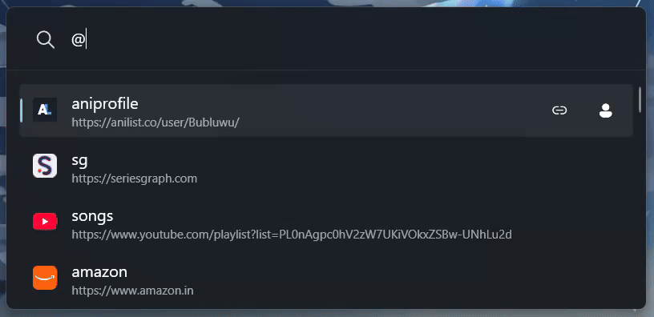
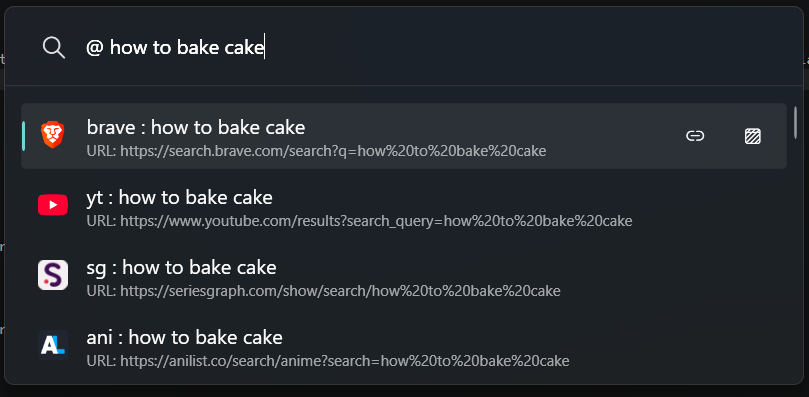
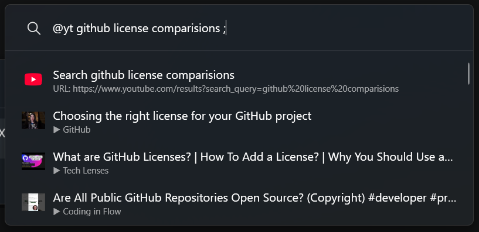
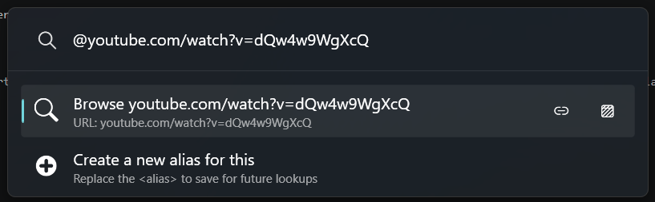
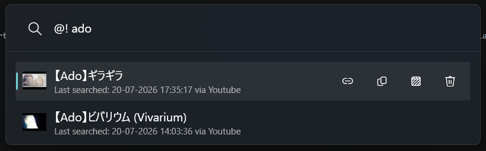
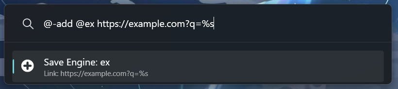
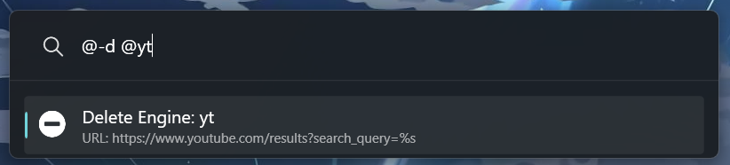

# BrowserConnect for PowerToys Run


**BrowserConnect** is a PowerToys Run plugin for searching custom engines, opening URLs, browsing in incognito mode, fetching live provider results, and searching local history with fuzzy matching.

Start BrowserConnect in PowerToys Run with the action keyword `@`, then enter a search, URL, or command.

## Table of Contents

- [Key Features](#key-features)
- [Feature Demos](#feature-demos)
- [Command Guide](#command-guide)
- [Context Menu Actions](#context-menu-actions)
- [Supported Browsers](#supported-browsers)
- [Local Files](#local-files)
- [Available Settings](#available-settings)
- [Prerequisites](#prerequisites)
- [Installation](#installation)
- [Usage](#usage)
- [Uninstall](#uninstall)
- [Development](#development)
- [Project Structure](#project-structure)
- [FAQ](#faq)
- [Troubleshooting](#troubleshooting)
- [Development Notes](#development-notes)

## Key Features
- **Custom Search Engines**
  - Create aliases such as `yt` or `github` for faster searches.
  - Support `%s` search templates and direct URL shortcuts.

- **Fuzzy History Search**
  - Search local history with `!`, including URLs, provider results, and normalized queries.
  - Shows newest unique entries first, supports fuzzy matching, and lets you delete entries from the context menu.

- **Incognito Search**
  - Add `-i` to searches or URLs for private browsing.
  - Enable incognito by default from PowerToys settings.

- **Integrated Settings**
  - Configure history recording, incognito history, and default incognito mode.
  - Control history result count, maximum history size, and automatic truncation.

- **Smart Filtering**
  - Filter configured search engines as you type.
  - Instantly discover matching aliases without remembering every shortcut.

- **Multi-Engine Queries**
  - Search multiple engines simultaneously with a single command.
  - Use `<engine1> <engine2> : <query>` (for example, `yt brave : how to bake a cake`).

- **Live Provider Results**
  - Append `;` to supported searches to fetch live results from YouTube, AniList, and SeriesGraph.
  - Providers are detected automatically, cache thumbnails, and save opened results to history. YouTube supports optional API keys via `google_api.txt`.

- **Icons and Context Menus**
  - Automatically downloads favicons and adapts icons to the current Windows theme.
  - Provides context actions for copying URLs, titles, and file paths, toggling incognito mode, and deleting history entries.
## Feature Demos

### Search With Custom Engines


### Search and Manage History


### Live Provider Results



## Command Guide

These examples show the query after the `@` action keyword. For example, type `@ yt cake recipe` in PowerToys Run.

| Command | Action | Example |
| :------ | :----- | :------ |
| **`<alias> <query>`** | Search using a custom engine | `yt cake recipe` |
| **`@<alias> <query>`** | Search or filter by alias | `@yt ado songs` |
| **`<e1> <e2> : <query>`** | Multi-engine search | `ani yt : Summer Time Rendering` |
| **`<URL>`** | Open a URL directly | `youtube.com/watch?v=dQw4w9WgXcQ` |
| **`<cmd> -i`** | Force incognito mode | `yt -i secret` |
| **`<alias> <query> ;`** | Fetch live provider results | `yt vivarium ;` |
| **`!`** | View recent history | `!` |
| **`!<query>`** | Fuzzy search history | `!cake` |

### Utility Commands

- `-help`: Show the help menu.
- `-add @alias URL`: Add or update an engine.
- `-d @alias`: Delete an engine and its icons.
- `-r`: Reload engines and history, clear icon failure cache, and clear the YouTube cache.
- `-l`: Open `searchEngines.txt`.
- `-his`: Open `history.txt`.
- `-log`: Open `logs.txt`.

## Context Menu Actions

BrowserConnect adds context actions based on the selected result type:

| Result Type | Shortcut | Action |
| :---------- | :------- | :----- |
| URL-backed results | `Ctrl+C` | Copy URL |
| File-opening results | `Ctrl+C` | Copy file path |
| Live fetched results | `Ctrl+Shift+C` | Copy result title |
| URL-backed results | `Ctrl+Shift+N` | Open in the opposite incognito state |
| History results | `Ctrl+Del` | Delete the history entry |

## Supported Browsers

Normal browsing uses your Windows default browser. Incognito mode is supported when BrowserConnect can detect one of these browser executables:

| Browser | Incognito Mode |
| :------ | :------------- |
| Google Chrome | `--incognito` |
| Brave | `--incognito` |
| Microsoft Edge | `--inprivate` |
| Firefox | `-private-window` |
| Opera | `--private` |
| Vivaldi | `--incognito` |
| Arc | `--incognito` |

If the default browser cannot be detected, BrowserConnect falls back to the Windows URL handler. That fallback can still open URLs normally, but it cannot force incognito mode.

## Local Files

The plugin stores its data locally in the installed plugin folder:

- **`searchEngines.txt`**: Search engine aliases, one per line: `alias URL`.
- **`history.txt`**: Search history for normalized engine queries, multi-engine searches, direct URLs, and opened live-provider results.
- **`logs.txt`**: Internal logs for troubleshooting.
- **`google_api.txt`**: Optional YouTube Data API keys, one per line.
- **`Images/`**: Bundled icons and cached engine favicons.
- **`Thumbnails/`**: Cached live-provider thumbnails.

History records the action that was opened. When viewing history, BrowserConnect shows the newest unique engine/payload pairs first.

Example `searchEngines.txt` entries:

```text
google https://www.google.com/search?q=%s
yt https://www.youtube.com/results?search_query=%s
github https://github.com/search?q=%s&type=repositories
```

Use `%s` where the search query should be inserted. If `%s` is not present, the engine behaves like a direct browse shortcut.

Live provider results are currently matched by these URL patterns:

```text
youtube.com/results?search_query=%s
anilist.co/search/anime?search=%s
seriesgraph.com/show/search/%s
```
## Available Settings

Settings are applied immediately, no PowerToys restart is required. They are available in the PowerToys Run plugin settings panel.

| Setting | Default | Description |
| :------ | :------ | :---------- |
| `Incognito by default` | `False` | Open searches and URLs in incognito/private browsing mode unless explicitly overridden. |
| `Record History` | `True` | Save engine searches, multi-engine searches, direct URLs, and live provider results to `history.txt`. |
| `Record Incognito History` | `False` | Save actions opened in incognito mode to `history.txt`. |
| `Automatically Truncate History` | `False` | Automatically trim `history.txt` when the configured history limit is reached. |
| `Max History Entries` | `3000` | Maximum number of history entries retained when automatic truncation runs. |
| `History Results Count` | `1500` | Maximum number of recent unique history entries available for `!` history searches. |

## Prerequisites

- Windows with PowerToys installed.
- PowerToys Run enabled.
- .NET 9 or later. [Download here](https://dotnet.microsoft.com/en-us/download/dotnet/9.0)
  - **For development:** .NET 9 SDK or later
  - **For using the plugin:** .NET 9 Desktop Runtime or later
## Installation

### Option 1: Install from a Release

1. Download the latest release from the [Releases](https://github.com/bharath6115/BrowserConnect_PowerToysRun/releases) page.
2. Extract the contents into the PowerToys Run Plugins directory:

   ```text
   %LOCALAPPDATA%\Microsoft\PowerToys\PowerToys Run\Plugins\
   ```

3. Restart PowerToys.

### Option 2: Build from Source

1. **Clone the repository**:

   ```powershell
   git clone https://github.com/bharath6115/BrowserConnect_PowerToysRun.git
   cd BrowserConnect_PowerToysRun
   ```

2. **Build** by running:

   ```powershell
   scripts/build-plugin.bat
   ```

   This performs a clean Release build of `Community.PowerToys.Run.Plugin.BrowserConnect/BrowserConnect.csproj`.

3. **Install** by running:

   ```powershell
   scripts/install-plugin.bat
   ```

   The install script preserves existing `history.txt`, `searchEngines.txt`, and `google_api.txt` files. It closes and restarts PowerToys automatically when possible.

4. <span id="Youtube-Live-Results"></span>**Optional: Enable YouTube Live Results**
   - Create a project in Google Cloud Console.
   - Enable **YouTube Data API v3**.
   - Create an API key for public data.
   - Add one or more API keys, one per line, to:

   ```text
   %LOCALAPPDATA%\Microsoft\PowerToys\PowerToys Run\Plugins\BrowserConnect\google_api.txt
   ```

   This enables YouTube live results for searches such as `yt lofi ;`.

## Usage

1. Open PowerToys Run with `Alt + Space`.

2. Use the `@` action keyword followed by a search engine key and query:

   `@google cats`  
   `@yt lofi`

3. Use ⬆️ and ⬇️ keys to select a result and press Enter to open it.

4. Use context actions to perform additional actions such as copying URLs/titles, opening links in normal or incognito mode, and deleting history entries.

### Search

BrowserConnect supports custom search engines with live results for supported providers, including thumbnails where available.

<p>
  
  
</p>

### URLs

Enter a URL directly to open it in your browser:



### History

Previously searched queries can be searched and reused from query history.



### Search Engine Management

Add, edit, or remove search engines directly from BrowserConnect settings without modifying configuration files.




## Uninstall

Close PowerToys, then delete the BrowserConnect plugin folder:

```text
%LOCALAPPDATA%\Microsoft\PowerToys\PowerToys Run\Plugins\BrowserConnect
```

Restart PowerToys after removing the folder.

## Development

The repository contains the plugin project, an MSTest test project, build/install scripts, documentation assets, and a modular service/provider architecture.

Build the plugin project:

```powershell
dotnet build Community.PowerToys.Run.Plugin.BrowserConnect/BrowserConnect.csproj
```

Build the full solution:

```powershell
dotnet build browserConnect.sln
```

Run the MSTest suite:

```powershell
dotnet test Community.PowerToys.Run.Plugin.BrowserConnect.Tests/BrowserConnect.Tests.csproj
```

## Project Structure

```text
BrowserConnect/
|-- Community.PowerToys.Run.Plugin.BrowserConnect/
|   |-- Services/                 # Browser, engine, history, icon, context menu, and query services
|   |-- Providers/                # Live result providers such as YouTube, AniList, and SeriesGraph
|   |-- Handlers/                 # Flag, history, and command handlers
|   |-- Models/                   # Provider, history, and context models
|   |-- Interfaces/               # Shared contracts
|   |-- Settings/                 # PowerToys settings
|   |-- Utils/                    # Parsing, URL, result, and file helpers
|   |-- Consts/                   # Shared constants
|   |-- Assets/                   # Plugin assets and packaged resources
|   |-- Images/                   # Static icons
|   |-- Main.cs                   # Plugin entry point
|   |-- plugin.json               # Plugin metadata
|   `-- BrowserConnect.csproj     # Plugin project file
|-- Community.PowerToys.Run.Plugin.BrowserConnect.Tests/
|   |-- Services/                 # Service-layer unit tests
|   |-- Utils/                    # Utility tests
|   `-- BrowserConnect.Tests.csproj
|-- docs/
|   `-- gifs/                     # README demos and documentation media
|-- scripts/
|   |-- build-plugin.bat          # Clean Release build script
|   `-- install-plugin.bat        # Local PowerToys plugin installer
|-- .gitignore
|-- browserConnect.sln
`-- README.md
```

## FAQ

<details>
<summary><strong>Can I add or change url of a search engine?</strong></summary>

You can add or change url using the -add flag mentioned in [utility commands](#utility-commands).<br/>
Format: -add @\<alias> \<url>

</details>

<details>
<summary><strong>Why aren't YouTube live results showing?</strong></summary>

Make sure `google_api.txt` exists in the installed plugin folder and contains at least one valid YouTube Data API key. Live YouTube results also require an engine URL that matches `youtube.com/results?search_query=%s`.

</details>

<details>
<summary><strong>Do AniList and SeriesGraph need API keys?</strong></summary>

No. AniList and SeriesGraph live providers do not require local API keys.

</details>

<details>
<summary><strong>Why isn't incognito mode working?</strong></summary>

BrowserConnect can only force incognito mode when it detects a supported default browser. If detection fails, Windows opens the URL normally through the default URL handler.

</details>

<details>
<summary><strong>Where are my search engines stored?</strong></summary>

Search engines are stored in `searchEngines.txt` in the installed plugin folder. You can open it from the plugin by typing `-l`.

</details>

## Troubleshooting

**Alt + Space is not doing anything**

- Check if power toys is running and if power toys run is enabled.
- Check and run the activation shortcut of power toys run.

**Youtube Live Search is returning a error message**

- Check if the google_api.txt file is populated by following the steps mentioned [here](#youtube-live-results).

**Plugin doesn't appear in PowerToys Run**

- Check that the plugin is installed in:
  `%LOCALAPPDATA%\Microsoft\PowerToys\PowerToys Run\Plugins\BrowserConnect`
- Restart PowerToys completely.
- Check PowerToys Run settings to ensure the plugin is enabled.

**Search engines not loading**

- Open `searchEngines.txt` with `-l`.
- Verify the file format is correct: one engine per line, `alias URL`.
- Use `%s` in URLs where the search query should be inserted.

**Browser doesn't open**

- Verify your default browser is installed.
- BrowserConnect uses the Windows default browser for normal opens. Incognito mode is supported for common browsers when the browser executable can be detected.

---

## Development Notes

- The plugin action keyword is `@`.
- The plugin project is `Community.PowerToys.Run.Plugin.BrowserConnect/BrowserConnect.csproj`.
- The test project is `Community.PowerToys.Run.Plugin.BrowserConnect.Tests/BrowserConnect.Tests.csproj`.
- Both projects target `.NET 9` via `net9.0-windows`.
- Plugin builds support x64 and ARM64 through PowerToys dependency packages.
- Tests use MSTest.
- The codebase is organized around a service layer, provider system, command handlers, shared models, settings, and utility helpers.
- History entries use four pipe-separated fields: `<time>|<entry_type>|<payload>|<incognito>`.
- The payload field is URL-escaped on disk and decoded before being displayed or executed.
- `<RS>` denotes the ASCII Record Separator (`\u001E`), used internally to encode structured payloads inside one history field.

History entry types:

| Type | Format after payload decoding |
| :--- | :---------------------------- |
| URL | `<time>\|_URL\|url\|incognito` |
| Live provider | `<time>\|_LIVE\|title<RS>URL<RS>ThumbnailRef\|incognito` |
| Normal engine | `<time>\|alias\|normalized_query\|incognito` |
| Multi-engine | `<time>\|_MULTI\|engines.join(", ")<RS>Query\|incognito` |

Multi-engine searches are recorded as a `_MULTI` entry for replaying the full search, followed by normal engine entries for each selected alias.
